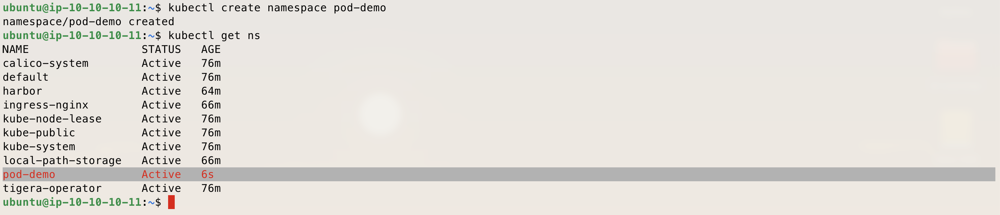
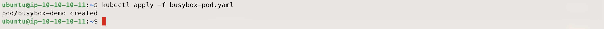
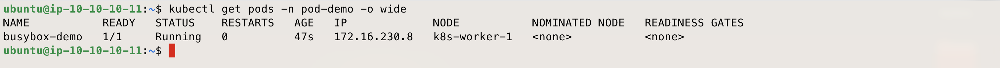
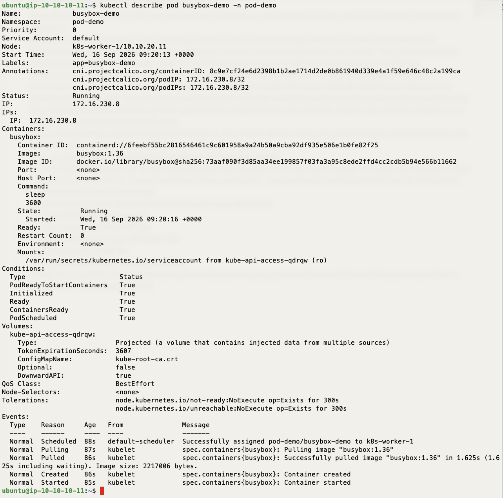
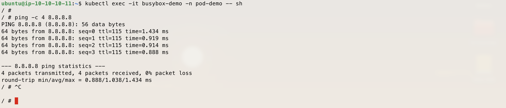

# Demo - Busybox Pod Basics - K8S On AWS With TerraForm Demo

*The simplest Kubernetes workload object, deployed and inspected by hand — a Pod, created, viewed, described, checked for logs, and exec'd into.*

---

## Description

This demo covers the most basic unit in Kubernetes: a Pod, deployed directly with no Deployment or ReplicaSet wrapping it. A single `busybox` pod is created on the cluster, and then inspected the way you would any workload day to day — listing it, describing it, checking its logs, and finally opening a shell inside it to run a simple network test (`ping 8.8.8.8`).

The goal is to demonstrate the basics of working with a Pod as a Kubernetes object — creating it, observing its state, and interacting with it — before later demos build on this with Deployments, networking objects, and storage.

---

## Prerequisites

- The Terraform in this repo already applied, and `install-k8s-node.sh` already run on every node.
- `kubectl` on the bastion, already pointed at the cluster (see the [Install README](../../Install/README.md), Step 6).
- No storage, no ingress, and no Harbor needed for this demo.

---

## How to Use

Before running the steps below, confirm you're logged in to the bastion and `kubectl` is working — run `kubectl get nodes` to check.

### Step 1 — Create the namespace

```bash
kubectl create namespace pod-demo
kubectl get ns
```



### Step 2 — Create the pod manifest

From the bastion, create `busybox-pod.yaml`:

```bash
cat <<EOF > busybox-pod.yaml
apiVersion: v1
kind: Pod
metadata:
  name: busybox-demo
  namespace: pod-demo
  labels:
    app: busybox-demo
spec:
  containers:
  - name: busybox
    image: busybox:1.36
    command: ["sleep", "3600"]
  restartPolicy: Never
EOF
```bash

> The `command` is deliberately set to `sleep 3600`. Busybox's default entrypoint exits immediately once started, which would otherwise leave the pod stuck in a crash-loop instead of `Running`.

### Step 3 — Deploy the pod

```bash
kubectl apply -f busybox-pod.yaml
```



| You can also create this pod with a direct kubectl run command instead of a YAML file. In production, YAML is still the preferred option, since it gives you more control and flexibility.
```bash
kubectl run busybox-demo -n pod-demo --image=busybox:1.36 --restart=Never -- sleep 3600
```

### Step 4 — Show the pod

```bash
kubectl get pods -n pod-demo -o wide
```

Confirms the pod is `Running`, and shows which node it landed on and its assigned IP.



### Step 5 — Describe the pod

```bash
kubectl describe pod busybox-demo -n pod-demo
```

The `Events` section at the bottom shows the scheduling decision and startup sequence in order.



### Step 6 — Check the pod's logs

```bash
kubectl logs busybox-demo -n pod-demo
```

The pod is just running `sleep`, so this will be empty — worth showing anyway, since `kubectl logs` is one of the first commands used to debug any real workload.

### Step 7 — Exec into the pod

```bash
kubectl exec -it busybox-demo -n pod-demo -- sh
```

### Step 8 — Run a simple test from inside the pod

```bash
ping -c 4 8.8.8.8
```



### Step 9 — [Optional] Exit and clean up

```bash
exit
kubectl delete -f busybox-pod.yaml
kubectl delete namespace pod-demo
```

---

Enjoy
