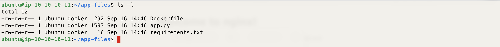
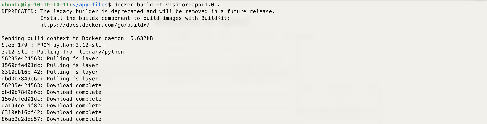
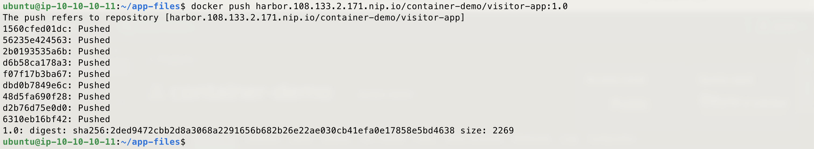
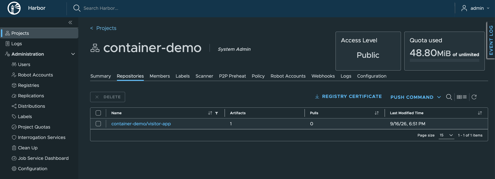
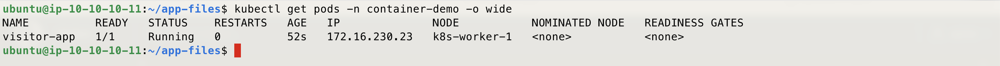
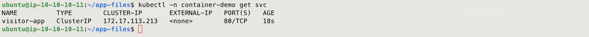
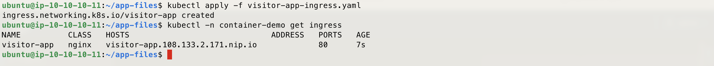
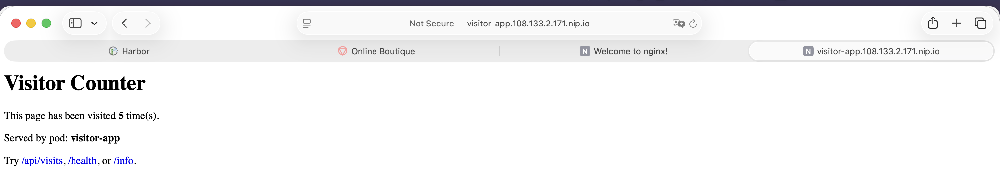
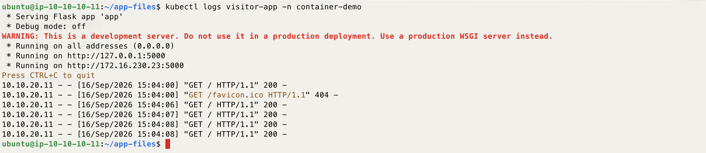

# Demo - Container From Scratch - Build, Push to Harbor & Deploy - K8S On AWS With TerraForm Demo

*A small Python app, built into a container image from scratch, pushed to Harbor, and deployed as a Pod.*

---

## Description

This demo covers the full lifecycle of a container image: building an image from the app source in `app-files/`, pushing it to the Harbor registry deployed in Prep, and running it on the cluster as a Pod.

The app itself is a small Flask web app called **Visitor Counter**. It does a bit more than print "hello world":

- Serves an HTML home page and increments an in-memory visit count on each hit.
- Exposes `/api/visits` as a JSON API returning the count and the pod's hostname.
- Exposes `/health`, a basic health check endpoint.
- Exposes `/info`, which returns platform details and reads an `APP_MESSAGE` environment variable (unset by default — a hook for a later demo on ConfigMaps/Secrets).

The visit count lives in memory only, so it resets whenever the pod restarts.

This builds on the previous Pod basics demo: same object (a Pod), but this time running an image you built yourself instead of a public one from Docker Hub.

---

## Prerequisites

- The Terraform, `install-k8s-node.sh`, and Prep steps already done — Harbor, `local-path-provisioner`, and `ingress-nginx` are up and running.
- `kubectl` on the bastion, already pointed at the cluster.
- `docker` on the bastion, already logged in to Harbor (from the Prep step's `docker login` command). If not, repeat that login before Step 8.
- Harbor reachable at `https://harbor.<lb-ip>.nip.io` (or your own DNS name), with its admin credentials to hand.
- This demo's `app-files/` folder (`app.py`, `requirements.txt`, `Dockerfile`) already in place in the repo, on the bastion.

---

## How to Use

Before running the steps below, confirm you're logged in to the bastion and `kubectl` is working — run `kubectl get nodes` to check.

### Step 1 — Create the namespace

```bash
kubectl create namespace container-demo
kubectl get ns
```


### Step 2 — Move into the app-files directory

```bash
cd app-files
```



### Step 3 — Build the image

```bash
docker build -t visitor-app:1.0 .
```



### Step 4 — Run the image locally to test it

```bash
docker run -d --name visitor-app-test -p 5000:5000 visitor-app:1.0
```


### Step 5 — Test it with curl

```bash
curl http://localhost:5000/api/visits
```

You should see a JSON response with `visits: 1` and a hostname matching the container ID.


### Step 6 — Stop and remove the test container

```bash
docker stop visitor-app-test && docker rm visitor-app-test
```



### Step 7 — Create a project in Harbor

Log in to the Harbor UI at `https://harbor.<lb-ip>.nip.io`. Go to **Projects > New Project**, name it `container-demo`, and set **Access Level** to **Public**. Keeping it public means Kubernetes can pull the image without an `imagePullSecret` — that's its own topic for a later demo.



### Step 8 — Tag the image for Harbor

Replace `<lb-ip>` with your Load Balancer's public IP (the Terraform output).

```bash
docker tag visitor-app:1.0 harbor.<lb-ip>.nip.io/container-demo/visitor-app:1.0
```


### Step 9 — Push the image to Harbor

```bash
docker push harbor.<lb-ip>.nip.io/container-demo/visitor-app:1.0
```



### Step 10 — Confirm the image is in Harbor

Browse to the `container-demo` project in the Harbor UI and confirm `visitor-app:1.0` is listed.



### Step 11 — Create the pod manifest

Replace `<lb-ip>` with your Load Balancer's public IP.

```bash
cat <<EOF > visitor-app-pod.yaml
apiVersion: v1
kind: Pod
metadata:
  name: visitor-app
  namespace: container-demo
  labels:
    app: visitor-app
spec:
  containers:
  - name: visitor-app
    image: harbor.<lb-ip>.nip.io/container-demo/visitor-app:1.0
    ports:
    - containerPort: 5000
  restartPolicy: Never
EOF
```



### Step 12 — Deploy the pod

```bash
kubectl apply -f visitor-app-pod.yaml
```



### Step 13 — Confirm the pod is running

```bash
kubectl get pods -n container-demo -o wide
```

If the pod is stuck in `ImagePullBackOff`, check that the Harbor project is set to Public and that the image tag matches exactly what you pushed.



### Step 14 — Port-forward to the pod

```bash
kubectl port-forward -n container-demo pod/visitor-app 5000:5000
```

This holds the terminal open — open a new terminal or session for the next step.


### Step 15 — Test the app through the port-forward

```bash
curl http://localhost:5000/api/visits
```

The hostname in the response should now match the pod name, not a local container ID.


### Step 16 — Check the pod's logs

```bash
kubectl logs visitor-app -n container-demo
```


### Step 17 — [Optional] Clean up

```bash
kubectl delete -f visitor-app-pod.yaml
kubectl delete namespace container-demo
```

---

Enjoy
