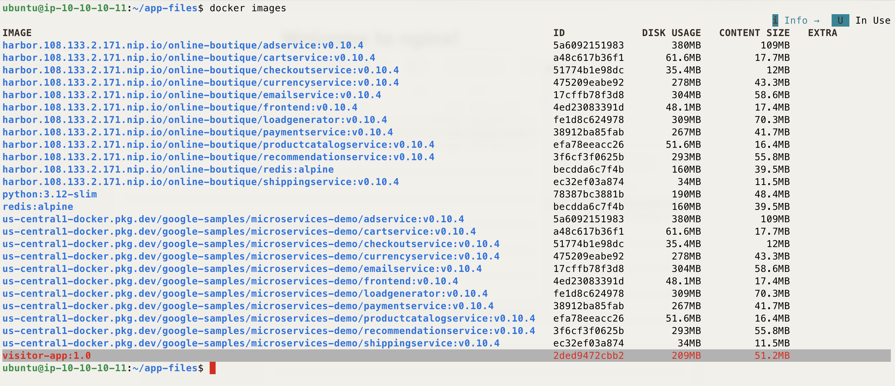

# Demo - Container From Scratch - Build, Push to Harbor & Deploy - K8S On AWS With TerraForm Demo

*A small Python app, built into a container image from scratch, pushed to Harbor, and deployed as a Pod.*

---

## Description

This demo covers the full lifecycle of a container image: building an image from the app source in `app-files/`, pushing it to the Harbor registry deployed in Prep, and running it on the cluster as a Pod.

The app itself is a small Flask web app called **Visitor Counter**. It does a bit more than print "hello world":

- Serves an HTML home page and increments an in-memory visit count on each hit.
- Exposes `/api/visits` as a JSON API returning the count and the pod's hostname.
- Exposes `/health`, a basic health check endpoint.
- Exposes `/info`, which returns platform details and reads an `APP_MESSAGE` environment variable (unset by default — a hook for a later demo on ConfigMaps/Secrets).

The visit count lives in memory only, so it resets whenever the pod restarts.

This builds on the previous Pod basics demo: same object (a Pod), but this time running an image you built yourself instead of a public one from Docker Hub.

---

## Prerequisites

- The Terraform, `install-k8s-node.sh`, and Prep steps already done — Harbor, `local-path-provisioner`, and `ingress-nginx` are up and running.
- `kubectl` on the bastion, already pointed at the cluster.
- `docker` on the bastion, already logged in to Harbor (from the Prep step's `docker login` command). If not, repeat that login before Step 8.
- Harbor reachable at `https://harbor.<lb-ip>.nip.io` (or your own DNS name), with its admin credentials to hand.
- Outbound internet access from the bastion to raw.githubusercontent.com, to pull this demo's app files in Step 2.

---

## How to Use

Before running the steps below, confirm you're logged in to the bastion and `kubectl` is working — run `kubectl get nodes` to check.

### Step 1 — Create the namespace

```bash
kubectl create namespace container-demo
kubectl get ns
```

### Step 2 — Download the app files from GitHub

The bastion has no direct access to this repo's files other than over the network, so pull `app.py`, `requirements.txt`, and `Dockerfile` straight from GitHub into a local `app-files` folder:

```bash
mkdir -p app-files && cd app-files
curl -fsSL "https://raw.githubusercontent.com/tahershaker/K8S-On-AWS-With-TerraForm-Demo/main/Demo/02-CONTAINER-Create-%26-Deploy_Container-From-Scratch/app-files/app.py" -o app.py
curl -fsSL "https://raw.githubusercontent.com/tahershaker/K8S-On-AWS-With-TerraForm-Demo/main/Demo/02-CONTAINER-Create-%26-Deploy_Container-From-Scratch/app-files/requirements.txt" -o requirements.txt
curl -fsSL "https://raw.githubusercontent.com/tahershaker/K8S-On-AWS-With-TerraForm-Demo/main/Demo/02-CONTAINER-Create-%26-Deploy_Container-From-Scratch/app-files/Dockerfile" -o Dockerfile
```


### Step 3 — Build the image

```bash
docker build -t visitor-app:1.0 .
```




### Step 4 — Create a project in Harbor

Log in to the Harbor UI at `https://harbor.<lb-ip>.nip.io`. Go to **Projects > New Project**, name it `container-demo`, and set **Access Level** to **Public**. Keeping it public means Kubernetes can pull the image without an `imagePullSecret` — that's its own topic for a later demo.

### Step 5 — Tag the image for Harbor

Replace `<lb-ip>` with your Load Balancer's public IP (the Terraform output).

```bash
docker tag visitor-app:1.0 harbor.<lb-ip>.nip.io/container-demo/visitor-app:1.0
```

### Step 6 — Push the image to Harbor

```bash
docker push harbor.<lb-ip>.nip.io/container-demo/visitor-app:1.0
```


### Step 7 — Confirm the image is in Harbor

Browse to the `container-demo` project in the Harbor UI and confirm `visitor-app:1.0` is listed.


### Step 8 — Create the pod manifest & Deploy 

Replace `<lb-ip>` with your Load Balancer's public IP.

```bash
cat <<EOF > visitor-app-pod.yaml
apiVersion: v1
kind: Pod
metadata:
  name: visitor-app
  namespace: container-demo
  labels:
    app: visitor-app
spec:
  containers:
  - name: visitor-app
    image: harbor.<lb-ip>.nip.io/container-demo/visitor-app:1.0
    ports:
    - containerPort: 5000
  restartPolicy: Never
EOF
```

Deploy Pod

```bash
kubectl apply -f visitor-app-pod.yaml
```


### Step 9 — Confirm the pod is running

```bash
kubectl get pods -n container-demo -o wide
```

If the pod is stuck in `ImagePullBackOff`, check that the Harbor project is set to Public and that the image tag matches exactly what you pushed.


### Step 10 — Create a Service for the pod

*A Service gives the pod a stable network identity inside the cluster so other things — including Ingress — can reach it. Services aren't covered in depth yet; that's its own demo later in this repo.*

```bash
cat <<EOF > visitor-app-service.yaml
apiVersion: v1
kind: Service
metadata:
  name: visitor-app
  namespace: container-demo
spec:
  selector:
    app: visitor-app
  ports:
  - port: 80
    targetPort: 5000
EOF
kubectl apply -f visitor-app-service.yaml
kubectl -n container-demo get svc
```


### Step 11 — Create an Ingress for the service

*Ingress routes external traffic into the cluster and forwards it to the Service, based on hostname. Ingress isn't covered in depth yet either — that's also its own demo later in this repo.*

Replace `<lb-ip>` with your Load Balancer's public IP.

```bash
cat <<EOF > visitor-app-ingress.yaml
apiVersion: networking.k8s.io/v1
kind: Ingress
metadata:
  name: visitor-app
  namespace: container-demo
spec:
  ingressClassName: nginx
  rules:
  - host: visitor-app.<lb-ip>.nip.io
    http:
      paths:
      - path: /
        pathType: Prefix
        backend:
          service:
            name: visitor-app
            port:
              number: 80
EOF
kubectl apply -f visitor-app-ingress.yaml
kubectl -n container-demo get ingress
```


### Step 12 — Test the app from a web browser

Open `http://visitor-app.<lb-ip>.nip.io` in a browser from your own machine. You should see the Visitor Counter home page, with the count incrementing on each refresh.


### Step 13 — Check the pod's logs

```bash
kubectl logs visitor-app -n container-demo
```


### Step 17 — [Optional] Clean up

> Note: a later demo (ConfigMap & Secrets) builds on top of this one — think twice before running this.

```bash
kubectl delete -f visitor-app-pod.yaml
kubectl delete namespace container-demo
```

---

Enjoy
