# Demo - Deployments with Online Boutique - K8S On AWS With TerraForm Demo

*The Deployment object, shown for real — Google's Online Boutique microservices app, pulled from the internet, pushed into our own Harbor registry, deployed, scaled, and exposed to the outside world.*

---

## Description

This demo covers the Deployment object: how it owns a ReplicaSet, how the ReplicaSet owns Pods, and how scaling a Deployment ripples down through both. Instead of a single throwaway container, it deploys [Online Boutique](https://github.com/GoogleCloudPlatform/microservices-demo) — an 11-service e-commerce app Google uses for the same purpose — so there's a realistic multi-Deployment workload to inspect.

Before deploying, the demo pulls every Online Boutique image from Google's public registry onto the bastion and re-pushes it into our own Harbor instance, so the cluster pulls images from infrastructure we control rather than the internet directly. Once deployed, it walks through the standard Deployment checks (`get deployment`, `get replicaset`, `get pods`, `describe`), scales the frontend to show the ReplicaSet reacting live, and finishes by exposing the app through an Ingress so it's reachable from a browser.

---

## Prerequisites

- The Terraform in this repo already applied, `install-k8s-node.sh` already run on every node, and the [Prep](../../Prep/README.md) step already done — this demo needs the default `StorageClass`, `ingress-nginx`, and Harbor all up and running.
- `kubectl` on the bastion, already pointed at the cluster.
- Docker on the bastion already logged in to Harbor (Prep Step 7). If that session has expired, log in again first:
  ```bash
  docker login <HARBOR_HOST> -u admin -p <HARBOR_PASSWORD>
  ```
- Admin access to the Harbor UI, to create a new project.
- The Load Balancer's public IP from the Terraform output — the same one Harbor's `nip.io` hostname is built from.
- Some free disk space on the bastion. Pulling and re-pushing 11 images uses real disk — worth a quick `df -h` if you haven't used this bastion in a while, since only the Kubernetes nodes' disk size is set by Terraform, not the bastion's.

---

## How to Use

Before running the steps below, confirm you're logged in to the bastion and `kubectl` is working — run `kubectl get nodes` to check.

### Step 1 — Create the namespace

```bash
kubectl create namespace deployment-demo
kubectl get ns
```

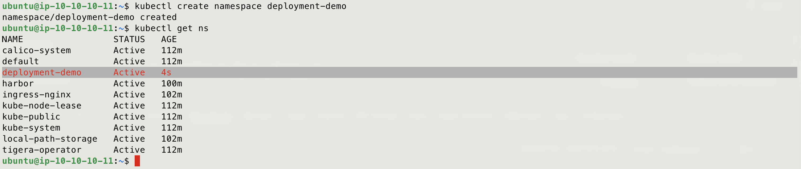

### Step 2 — Create a Harbor project for this demo

In the Harbor UI (`https://harbor.<lb-ip>.nip.io`), click **New Project**, name it `online-boutique`, and set access level to **Public**.

> Public avoids needing a Kubernetes `imagePullSecret` for this demo — a simplification worth naming out loud, not something you'd do with a real registry.

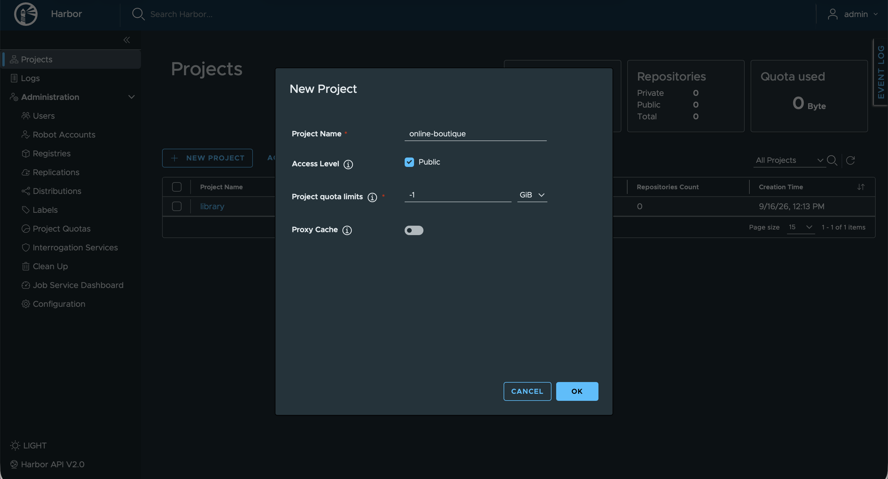

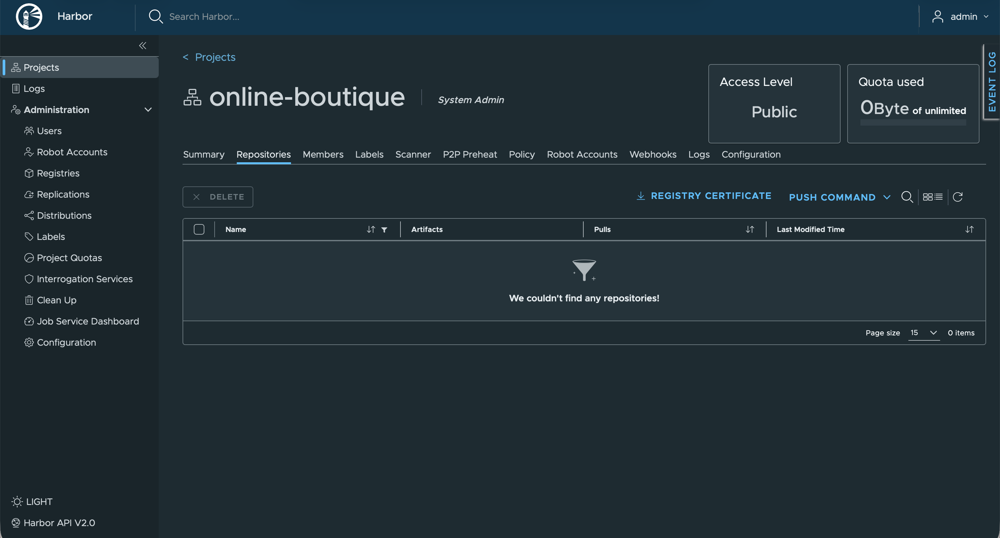

### Step 3 — Set the variables used below, and install yq for editing the manifest later

Set Variables

```bash
export LB_IP=<your-load-balancer-public-ip>
export HARBOR_HOST=harbor.${LB_IP}.nip.io
export PROJECT=online-boutique
```

Install yq

```bash
sudo curl -fsSL https://github.com/mikefarah/yq/releases/latest/download/yq_linux_amd64 -o /usr/local/bin/yq
sudo chmod +x /usr/local/bin/yq
yq --version
```

### Step 4 — Get the Online Boutique manifest

```bash
git clone --depth 1 --branch v0 https://github.com/GoogleCloudPlatform/microservices-demo.git
cp microservices-demo/release/kubernetes-manifests.yaml .
```

> Google has since moved this app's images off `gcr.io` onto Artifact Registry — the manifest now points at `us-central1-docker.pkg.dev/google-samples/microservices-demo/`, all pinned to `v0.10.4` at time of writing.

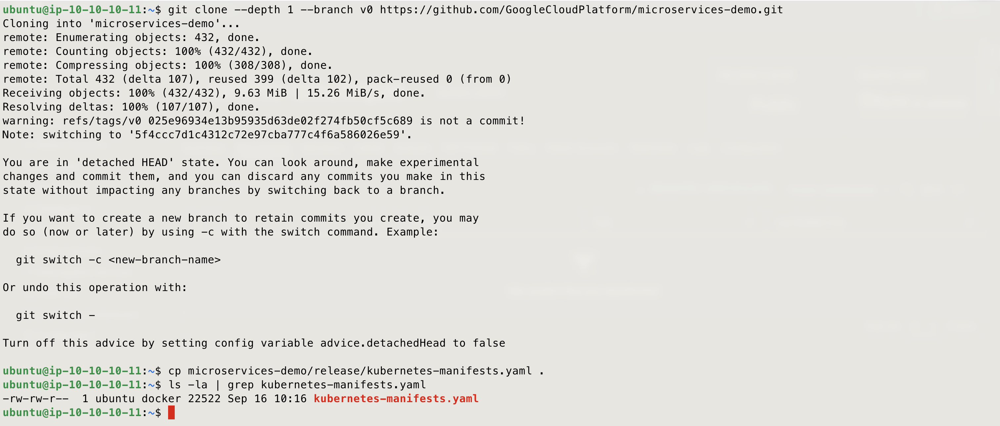

### Step 5 — Pull every image (12 services, listed explicitly)

> **Version note:** at the time of writing, all 12 services were pinned to `v0.10.4`. These tags are hardcoded below rather than read from the manifest — if you're running this demo later, check `kubernetes-manifests.yaml` first (`grep "image:" kubernetes-manifests.yaml`) and update the tags in this step and Step 6 if Google has shipped a newer release since.


```bash
docker pull us-central1-docker.pkg.dev/google-samples/microservices-demo/currencyservice:v0.10.4
docker pull us-central1-docker.pkg.dev/google-samples/microservices-demo/loadgenerator:v0.10.4
docker pull us-central1-docker.pkg.dev/google-samples/microservices-demo/productcatalogservice:v0.10.4
docker pull us-central1-docker.pkg.dev/google-samples/microservices-demo/checkoutservice:v0.10.4
docker pull us-central1-docker.pkg.dev/google-samples/microservices-demo/shippingservice:v0.10.4
docker pull us-central1-docker.pkg.dev/google-samples/microservices-demo/cartservice:v0.10.4
docker pull us-central1-docker.pkg.dev/google-samples/microservices-demo/emailservice:v0.10.4
docker pull us-central1-docker.pkg.dev/google-samples/microservices-demo/paymentservice:v0.10.4
docker pull us-central1-docker.pkg.dev/google-samples/microservices-demo/frontend:v0.10.4
docker pull us-central1-docker.pkg.dev/google-samples/microservices-demo/recommendationservice:v0.10.4
docker pull us-central1-docker.pkg.dev/google-samples/microservices-demo/adservice:v0.10.4
docker pull redis:alpine
```

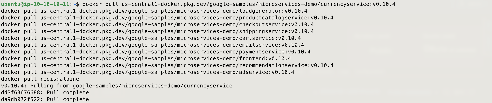

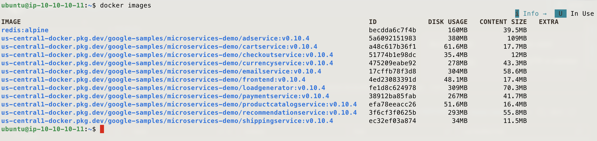

### Step 6 — Tag every image for Harbor (12 images, listed explicitly)

```bash
docker tag us-central1-docker.pkg.dev/google-samples/microservices-demo/currencyservice:v0.10.4 ${HARBOR_HOST}/${PROJECT}/currencyservice:v0.10.4
docker tag us-central1-docker.pkg.dev/google-samples/microservices-demo/loadgenerator:v0.10.4 ${HARBOR_HOST}/${PROJECT}/loadgenerator:v0.10.4
docker tag us-central1-docker.pkg.dev/google-samples/microservices-demo/productcatalogservice:v0.10.4 ${HARBOR_HOST}/${PROJECT}/productcatalogservice:v0.10.4
docker tag us-central1-docker.pkg.dev/google-samples/microservices-demo/checkoutservice:v0.10.4 ${HARBOR_HOST}/${PROJECT}/checkoutservice:v0.10.4
docker tag us-central1-docker.pkg.dev/google-samples/microservices-demo/shippingservice:v0.10.4 ${HARBOR_HOST}/${PROJECT}/shippingservice:v0.10.4
docker tag us-central1-docker.pkg.dev/google-samples/microservices-demo/cartservice:v0.10.4 ${HARBOR_HOST}/${PROJECT}/cartservice:v0.10.4
docker tag us-central1-docker.pkg.dev/google-samples/microservices-demo/emailservice:v0.10.4 ${HARBOR_HOST}/${PROJECT}/emailservice:v0.10.4
docker tag us-central1-docker.pkg.dev/google-samples/microservices-demo/paymentservice:v0.10.4 ${HARBOR_HOST}/${PROJECT}/paymentservice:v0.10.4
docker tag us-central1-docker.pkg.dev/google-samples/microservices-demo/frontend:v0.10.4 ${HARBOR_HOST}/${PROJECT}/frontend:v0.10.4
docker tag us-central1-docker.pkg.dev/google-samples/microservices-demo/recommendationservice:v0.10.4 ${HARBOR_HOST}/${PROJECT}/recommendationservice:v0.10.4
docker tag us-central1-docker.pkg.dev/google-samples/microservices-demo/adservice:v0.10.4 ${HARBOR_HOST}/${PROJECT}/adservice:v0.10.4
docker tag redis:alpine ${HARBOR_HOST}/${PROJECT}/redis:alpine
```

Confirm the new tags were created

```bash
docker images
```

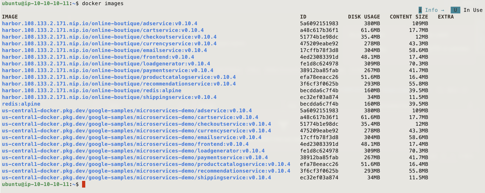

### Step 7 — Push every tagged image to Harbor (12 images, listed explicitly)

```bash
docker push ${HARBOR_HOST}/${PROJECT}/currencyservice:v0.10.4
docker push ${HARBOR_HOST}/${PROJECT}/loadgenerator:v0.10.4
docker push ${HARBOR_HOST}/${PROJECT}/productcatalogservice:v0.10.4
docker push ${HARBOR_HOST}/${PROJECT}/checkoutservice:v0.10.4
docker push ${HARBOR_HOST}/${PROJECT}/shippingservice:v0.10.4
docker push ${HARBOR_HOST}/${PROJECT}/cartservice:v0.10.4
docker push ${HARBOR_HOST}/${PROJECT}/emailservice:v0.10.4
docker push ${HARBOR_HOST}/${PROJECT}/paymentservice:v0.10.4
docker push ${HARBOR_HOST}/${PROJECT}/frontend:v0.10.4
docker push ${HARBOR_HOST}/${PROJECT}/recommendationservice:v0.10.4
docker push ${HARBOR_HOST}/${PROJECT}/adservice:v0.10.4
docker push ${HARBOR_HOST}/${PROJECT}/redis:alpine
```

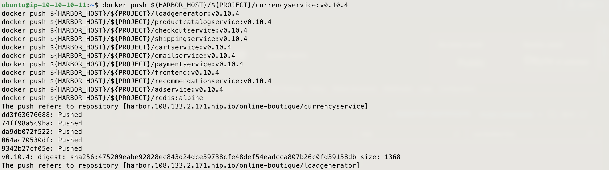

Confirm the images landed in Harbor. - Browse to the `online-boutique` project in the Harbor UI and check all 12 repositories are listed.

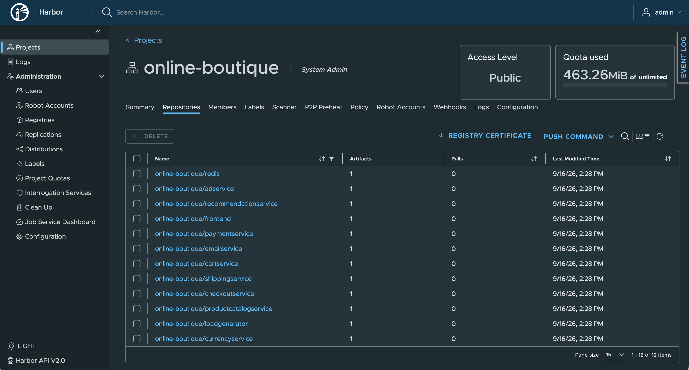

### Step 8 — Point the manifest at Harbor instead of Google's registry

Rewrite the manifest to pull every image from Harbor instead of Google's registry and Docker Hub.

```bash
sed "s#us-central1-docker.pkg.dev/google-samples/microservices-demo#${HARBOR_HOST}/${PROJECT}#g" kubernetes-manifests.yaml > kubernetes-manifests-harbor.yaml
sed -i "s#image: redis:alpine#image: ${HARBOR_HOST}/${PROJECT}/redis:alpine#g" kubernetes-manifests-harbor.yaml
grep "image:" kubernetes-manifests-harbor.yaml
```

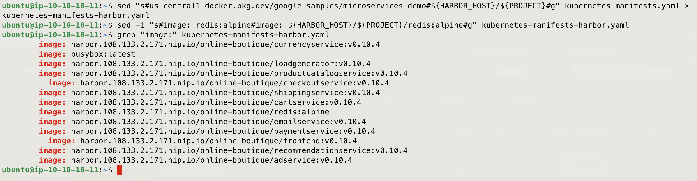

### Step 9 — Remove the frontend-external Service from the manifest

The default manifest exposes the frontend through a `LoadBalancer`-type Service. This cluster has no cloud-controller-manager integration, so that Service can never get an external IP — it will sit at `<pending>` indefinitely. We remove it here and expose the frontend through an Ingress instead in the next step.

> If your environment has a load balancer available and already integrated with Kubernetes, skip this step and Step 10 — your `frontend-external` Service will work as-is.

```bash
yq eval-all 'select(.kind != "Service" or .metadata.name != "frontend-external")' kubernetes-manifests-harbor.yaml > tmp.yaml && mv tmp.yaml kubernetes-manifests-harbor.yaml
grep -c "frontend-external" kubernetes-manifests-harbor.yaml
```

> The above grep should return `0`

### Step 10 — Create and apply an Ingress to expose the frontend

With the LoadBalancer Service removed, this step deploys an Ingress instead, routing traffic to the existing `frontend` ClusterIP Service through the `ingress-nginx` controller already installed in this cluster.

```bash
cat <<EOF > frontend-ingress.yaml
apiVersion: networking.k8s.io/v1
kind: Ingress
metadata:
  name: frontend-ingress
  namespace: deployment-demo
spec:
  ingressClassName: nginx
  rules:
  - host: demo-app.${LB_IP}.nip.io
    http:
      paths:
      - path: /
        pathType: Prefix
        backend:
          service:
            name: frontend
            port:
              number: 80
EOF
kubectl apply -f frontend-ingress.yaml
kubectl -n deployment-demo get ingress
```

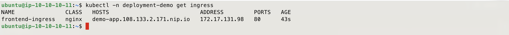

### Step 11 — Deploy the application

```bash
kubectl apply -f kubernetes-manifests-harbor.yaml -n deployment-demo
```

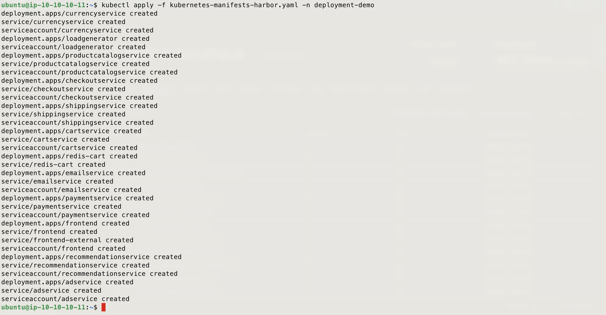

### Step 12 — Check the Deployments

```bash
kubectl get deployments -n deployment-demo
```

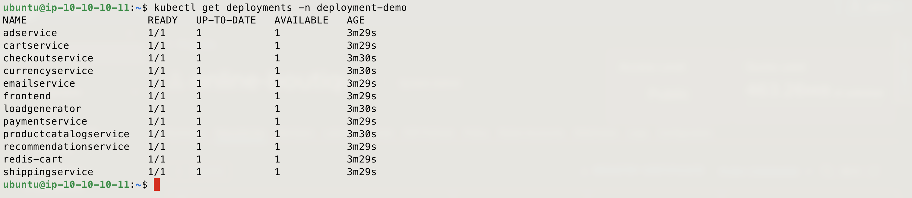

### Step 13 — Check the ReplicaSets

```bash
kubectl get replicasets -n deployment-demo
```

Every ReplicaSet here shows a desired count of 1, matching the single replica each Deployment currently specifies — current state matches desired state, which is exactly what a healthy Deployment looks like. Note also how each ReplicaSet's name is the Deployment's name plus a hash — that hash comes from the Pod template, and it's what changes on a new rollout.

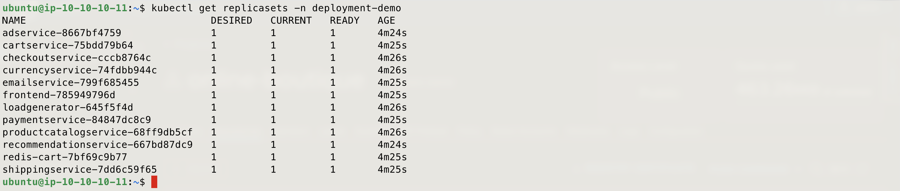

### Step 14 — Check the Pods

```bash
kubectl get pods -n deployment-demo -o wide
```

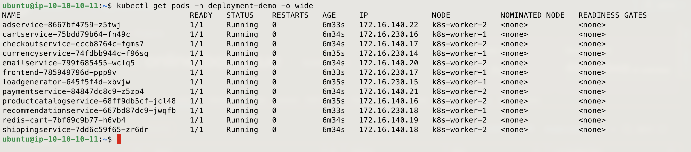

### Step 15 — Describe the frontend Deployment

```bash
kubectl describe deployment frontend -n deployment-demo
```

The `Events` at the bottom show the Deployment creating its ReplicaSet, which is the mechanism the next few steps make visible.

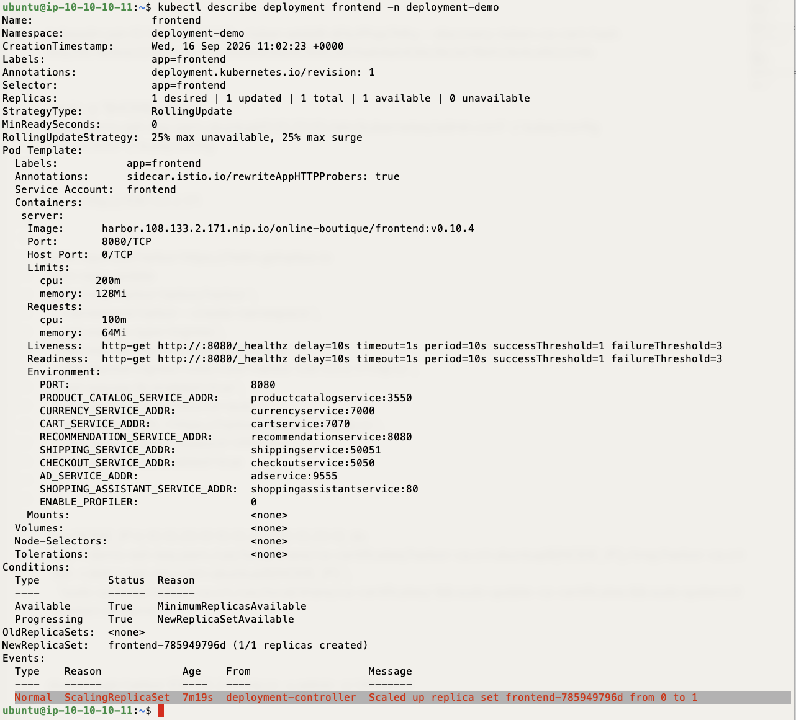

### Step 13 — Scale the frontend Deployment

Increase the frontend Deployment's replica count to see the ReplicaSet react.

```bash
kubectl scale deployment frontend -n deployment-demo --replicas=3
```

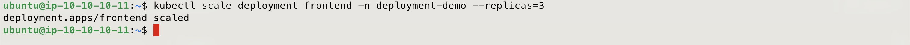

### Step 17 — Watch the ReplicaSet and Pods respond

```bash
kubectl get replicaset -n deployment-demo
kubectl get pods -n deployment-demo -o wide -l app=frontend
```

The Deployment only changed the ReplicaSet's desired count — the ReplicaSet controller is what actually created the extra Pods.

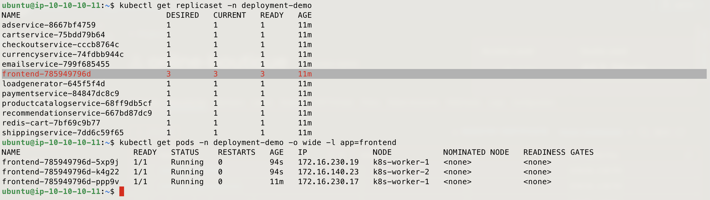

### Step 18 — Check the rollout status

Confirm the scale-up finished successfully and all replicas are ready.

```bash
kubectl rollout status deployment frontend -n deployment-demo
```

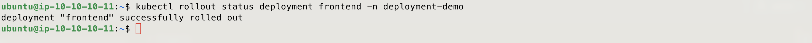

### Step 19 — Access the app from outside

With the Ingress in place, the frontend is now reachable through the Load Balancer without needing to port-forward or exec into the cluster.

```bash
curl -I http://demo-app.${LB_IP}.nip.io
```

Then open `http://demo-app.<lb-ip>.nip.io` in a browser to browse the store.

> The hostname configured when the Ingress was created earlier (Step 10) was `demo-app.<lb-ip>.nip.io` — use that exact host. If you changed it there, update it here too so the two stay in sync.

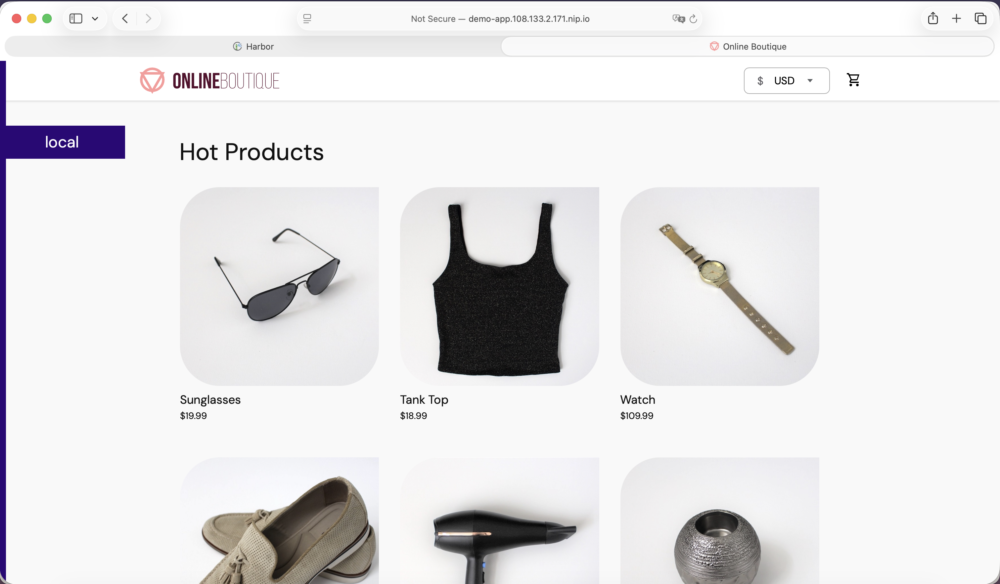

### Step 21 — [Optional] Clean up 

> Note: a later demo builds on top of this one — think twice before running this.

```bash
kubectl delete -f frontend-ingress.yaml
kubectl delete -f kubernetes-manifests-harbor.yaml -n deployment-demo
kubectl delete namespace deployment-demo
```

---

Enjoy
