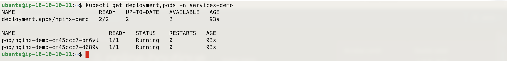
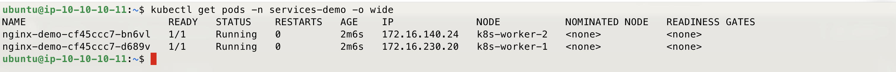
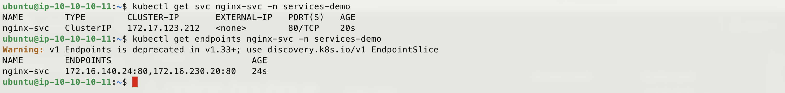
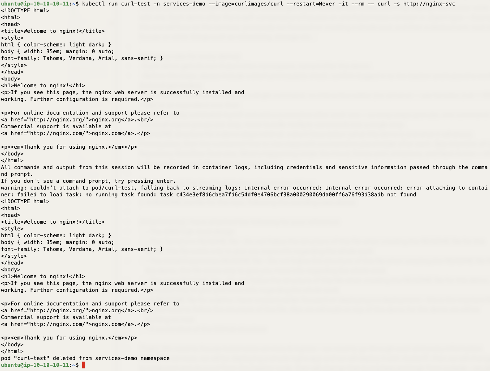
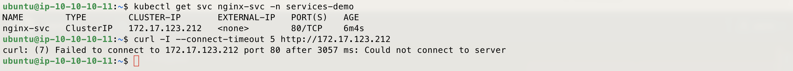
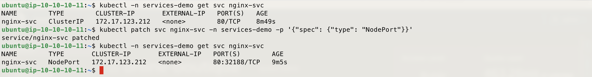
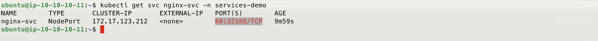
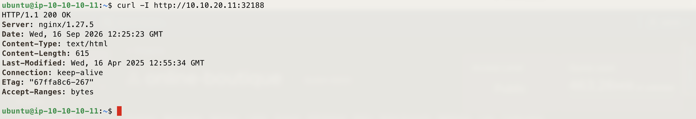
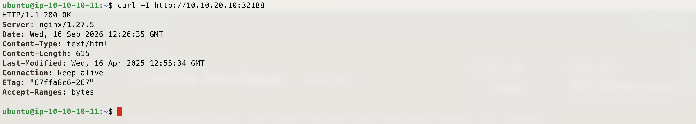
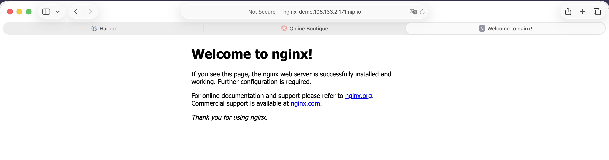

# Demo - Services & Ingress - K8S On AWS With TerraForm Demo

*From a pod's private IP to a public URL — ClusterIP, NodePort, and Ingress, each one built on top of the last.*

---

## Description

This demo covers Kubernetes Services and Ingress: what problem each one solves, and how they stack on top of each other. It deploys a plain `nginx` app and exposes it three different ways in sequence — first as a `ClusterIP` Service, then changed to `NodePort`, then finally routed through an `Ingress` — testing access after each change so the difference is visible, not just described.

The earlier Deployment demo (`deployment-demo` namespace) used an Ingress to expose the Online Boutique frontend, but didn't explain the Service layer underneath it. This demo is that missing layer: it shows why a Service exists at all, why NodePort is really just a ClusterIP Service opened on every node, and why Ingress (via the same `ingress-nginx` controller from the Prep step) is what the Load Balancer is actually talking to.

---

## Prerequisites

- The Terraform in this repo already applied, `install-k8s-node.sh` already run on every node, and the [Prep](../../Prep/README.md) step already done — this demo needs `ingress-nginx` up and running.
- `kubectl` on the bastion, already pointed at the cluster.
- The Load Balancer's public IP from the Terraform output.
- The private IPs of at least one worker node and the master node (default topology: master `10.10.20.10`, worker 1 `10.10.20.11`, worker 2 `10.10.20.12`).

---

## How to Use

Before running the steps below, confirm you're logged in to the bastion and `kubectl` is working — run `kubectl get nodes` to check.

### Step 1 — Create the namespace

```bash
kubectl create namespace services-demo
kubectl get ns
```

---

### Step 2 — Deploy the nginx application

A plain nginx Deployment, 2 replicas — the app itself doesn't matter here, only how it gets exposed.

```bash
cat <<EOF | kubectl apply -f -
apiVersion: apps/v1
kind: Deployment
metadata:
  name: nginx-demo
  namespace: services-demo
spec:
  replicas: 2
  selector:
    matchLabels:
      app: nginx-demo
  template:
    metadata:
      labels:
        app: nginx-demo
    spec:
      containers:
      - name: nginx
        image: nginx:1.27-alpine
        ports:
        - containerPort: 80
EOF
```

---

### Step 3 — Confirm the Deployment and Pods are up

```bash
kubectl get deployment,pods -n services-demo
```



---

### Step 4 — Check the Pod IPs

```bash
kubectl get pods -n services-demo -o wide
```

Note the IP address next to each pod — this is the pod network IP, private to the cluster's CNI and assigned fresh every time a pod is created.



---

### Step 5 — Try to reach a Pod IP directly from the bastion

Replace `<pod-ip>` with one of the IPs from the previous step.

```bash
curl -I --connect-timeout 5 http://<pod-ip>
```

This should fail or time out. The bastion sits outside the cluster's pod network — pod IPs aren't routable from it. This is the gap a Service exists to close.

---

### Step 6 — Create a ClusterIP Service

```bash
cat <<EOF | kubectl apply -f -
apiVersion: v1
kind: Service
metadata:
  name: nginx-svc
  namespace: services-demo
spec:
  type: ClusterIP
  selector:
    app: nginx-demo
  ports:
  - port: 80
    targetPort: 80
EOF
```

---

### Step 7 — Inspect the Service and its Endpoints

```bash
kubectl get svc nginx-svc -n services-demo
kubectl get endpoints nginx-svc -n services-demo
```

The Endpoints object lists the same pod IPs from Step 4 — the Service's label selector (`app: nginx-demo`) is what ties them together. This list updates automatically as pods come and go; the Service's own ClusterIP never changes.



---

### Step 8 — Curl the Service from inside the cluster

A throwaway pod, run inside the cluster's network, to confirm the Service resolves and load-balances to the pods.

This command creates a temporary pod called `curl-test` in the `services-demo` namespace, using the `curlimages/curl` image, then runs a curl against the Service's DNS name inside that pod. `--rm` deletes the pod as soon as the command finishes, so nothing is left behind. This confirms the Service resolves and load-balances to the pods.


```bash
kubectl run curl-test -n services-demo --image=curlimages/curl --restart=Never -it --rm -- curl -s http://nginx-svc
```



---

### Step 9 — Try to curl the ClusterIP directly from the bastion

Get the Service's ClusterIP first:

```bash
kubectl get svc nginx-svc -n services-demo
```

Then curl it directly from the bastion, replacing `<cluster-ip>` with the address from the command above:

```bash
curl -I --connect-timeout 5 http://<cluster-ip>
```

This should fail or time out. A ClusterIP is only routable from inside the cluster's pod network — the bastion sits outside it, same as with the raw pod IP in Step 5. This is what makes NodePort and Ingress necessary for anything outside the cluster.



---

### Step 10 — Change the Service to NodePort

This command patches the `nginx-svc` Service created earlier, changing its type from ClusterIP to NodePort.

```bash
kubectl patch svc nginx-svc -n services-demo -p '{"spec": {"type": "NodePort"}}'
```



---

### Step 11 — Get the assigned NodePort

```bash
kubectl get svc nginx-svc -n services-demo
```

Note the port shown in the `80:<node-port>/TCP` column — you'll need it for the next two steps.



---

### Step 12 — Curl the NodePort on worker node 1

Replace `<node-port>` with the value from the previous step.

```bash
curl -I http://10.10.20.11:<node-port>
```

This works because NodePort opens the same port on every node in the cluster, not just the one running the pod — the bastion is now reaching the nginx pod through the node's port, something it couldn't do with ClusterIP.



---

### Step 13 — Curl the same NodePort on the master node

```bash
curl -I http://10.10.20.10:<node-port>
```

Same result, even though no nginx pod is running on the master. NodePort opens the same port on every node in the cluster — kube-proxy on each node forwards it back to the ClusterIP, which then reaches whichever pod is actually running.



---

### Step 14 — Revert the Service back to ClusterIP

Ingress routes to a Service internally, through the cluster network — it doesn't need NodePort.

```bash
kubectl patch svc nginx-svc -n services-demo -p '{"spec": {"type": "ClusterIP"}}'
```

---

### Step 15 — Set the Load Balancer IP variable

```bash
export LB_IP=<your-load-balancer-public-ip>
```

---

### Step 16 — Create the Ingress resource

```bash
cat <<EOF | kubectl apply -f -
apiVersion: networking.k8s.io/v1
kind: Ingress
metadata:
  name: nginx-ingress
  namespace: services-demo
spec:
  ingressClassName: nginx
  rules:
  - host: nginx-demo.${LB_IP}.nip.io
    http:
      paths:
      - path: /
        pathType: Prefix
        backend:
          service:
            name: nginx-svc
            port:
              number: 80
EOF
```

---

### Step 17 — Confirm the Ingress is created

```bash
kubectl get ingress -n services-demo
```


---

### Step 18 — Curl the app from outside the cluster

Run this from your own machine, not the bastion — this is the external path: Load Balancer → `ingress-nginx` → Service → Pod.

```bash
curl -I http://nginx-demo.${LB_IP}.nip.io
```


---

### Step 19 — Open it in a browser

Browse to `http://nginx-demo.<lb-ip>.nip.io` and confirm the nginx welcome page loads.



---

### Step 20 — [Optional] Clean up

```bash
kubectl delete ingress nginx-ingress -n services-demo
kubectl delete svc nginx-svc -n services-demo
kubectl delete deployment nginx-demo -n services-demo
kubectl delete namespace services-demo
```

---

Enjoy