# Demo - Storage Basics (PV, PVC & StorageClass) - K8S On AWS With TerraForm Demo

*The same Pod, the same file, shown twice — once with no persistent storage and once with a PVC — to make the point that a Pod's own filesystem dies with it, and a PersistentVolumeClaim doesn't.*

---

## Description

This demo covers Kubernetes storage: `PersistentVolume` (PV), `PersistentVolumeClaim` (PVC), and `StorageClass`, using the `local-path-provisioner` StorageClass already deployed in the Prep step.

The comparison is deliberately simple. An nginx Pod is deployed with no volume at all, a custom file is written into it, and the Pod is deleted and recreated — the file is gone, because it only ever existed inside that one container's filesystem. The exact same steps are then repeated with a PVC mounted into the Pod at the same path — after deleting and recreating the Pod, the file is still there, because the data lived in the PVC, not the Pod.

Along the way, this also shows that a PVC and its underlying PV are objects independent of any Pod — deleting the Pod does not delete them.

---

## Prerequisites

- The Terraform, `install-k8s-node.sh`, and Prep steps already done — `local-path-provisioner` is installed and set as the default `StorageClass`.
- `kubectl` on the bastion, already pointed at the cluster.
- No Harbor and no ingress needed for this demo.

---

## How to Use

Before running the steps below, confirm you're logged in to the bastion and `kubectl` is working — run `kubectl get nodes` to check.

### Step 1 — Create the namespace

```bash
kubectl create namespace storage-demo
kubectl get ns
```

---

### Part A — Without a PVC

### Step 2 — Create the pod manifest (no volume)

```bash
cat <<EOF > nginx-no-pvc.yaml
apiVersion: v1
kind: Pod
metadata:
  name: nginx-no-pvc
  namespace: storage-demo
  labels:
    app: nginx-no-pvc
spec:
  containers:
  - name: nginx
    image: nginx:1.27
    ports:
    - containerPort: 80
EOF
```

### Step 3 — Deploy the pod

```bash
kubectl apply -f nginx-no-pvc.yaml
kubectl get pods -n storage-demo -o wide
```

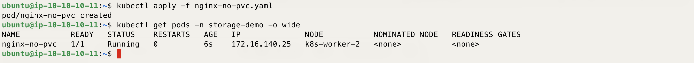

### Step 4 — Write a custom file into the pod

```bash
kubectl exec -it nginx-no-pvc -n storage-demo -- sh -c 'echo "Hello from storage-demo - no PVC" > /usr/share/nginx/html/index.html'
```

### Step 5 — Confirm the file is there

```bash
kubectl exec -it nginx-no-pvc -n storage-demo -- cat /usr/share/nginx/html/index.html
```

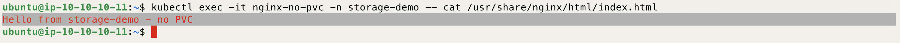

### Step 6 — Delete the pod

```bash
kubectl delete pod nginx-no-pvc -n storage-demo
```

### Step 7 — Recreate the pod from the same manifest

```bash
kubectl apply -f nginx-no-pvc.yaml
kubectl get pods -n storage-demo -o wide
```

### Step 8 — Check the file again

```bash
kubectl exec -it nginx-no-pvc -n storage-demo -- cat /usr/share/nginx/html/index.html
```

This now shows nginx's default welcome page, not the custom text. The file lived only in the old container's filesystem, and that filesystem was gone the moment the Pod was deleted.

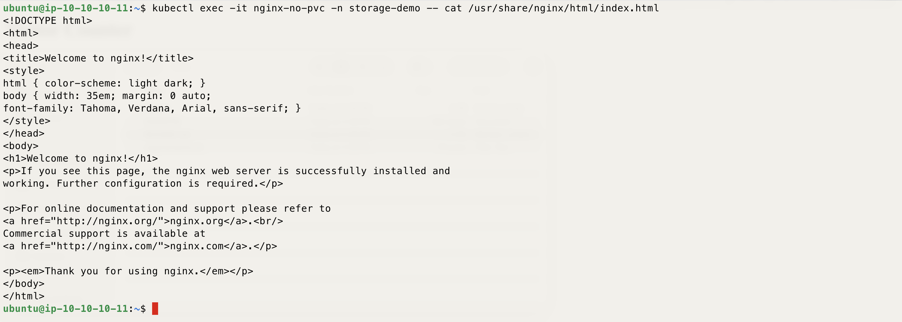

---

### Part B — With a PVC

### Step 9 — Confirm the default StorageClass

`local-path` was installed and set as the default StorageClass during the Prep step. If it does not show up here, go back and revisit Prep before continuing.

```bash
kubectl get storageclass
```

Look for `local-path` marked `(default)` — this is what will provision the PV behind the PVC in the next step.

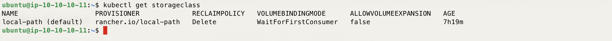

### Step 10 — Create the PVC manifest

```bash
cat <<EOF > nginx-pvc.yaml
apiVersion: v1
kind: PersistentVolumeClaim
metadata:
  name: nginx-pvc
  namespace: storage-demo
spec:
  accessModes:
    - ReadWriteOnce
  storageClassName: local-path
  resources:
    requests:
      storage: 1Gi
EOF
```

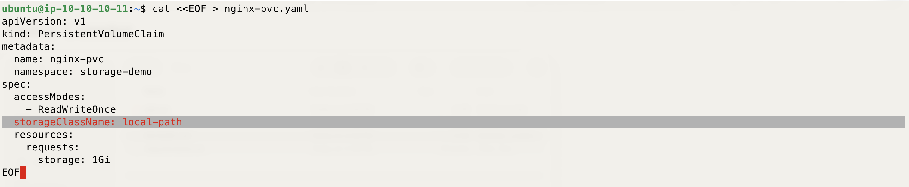

### Step 11 — Create the PVC

```bash
kubectl apply -f nginx-pvc.yaml
kubectl get pvc -n storage-demo
```

The `STATUS` will show `Pending` — that's expected. `local-path` uses `WaitForFirstConsumer` binding, so it waits until a pod actually claims this PVC before provisioning anything. It will bind once the deployment in the next steps is created.

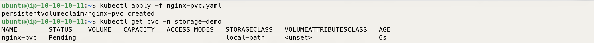

### Step 12 — Create the pod manifest (with the PVC mounted)

```bash
cat <<EOF > nginx-with-pvc.yaml
apiVersion: v1
kind: Pod
metadata:
  name: nginx-with-pvc
  namespace: storage-demo
  labels:
    app: nginx-with-pvc
spec:
  containers:
  - name: nginx
    image: nginx:1.27
    ports:
    - containerPort: 80
    volumeMounts:
    - name: html-storage
      mountPath: /usr/share/nginx/html
  volumes:
  - name: html-storage
    persistentVolumeClaim:
      claimName: nginx-pvc
EOF
```

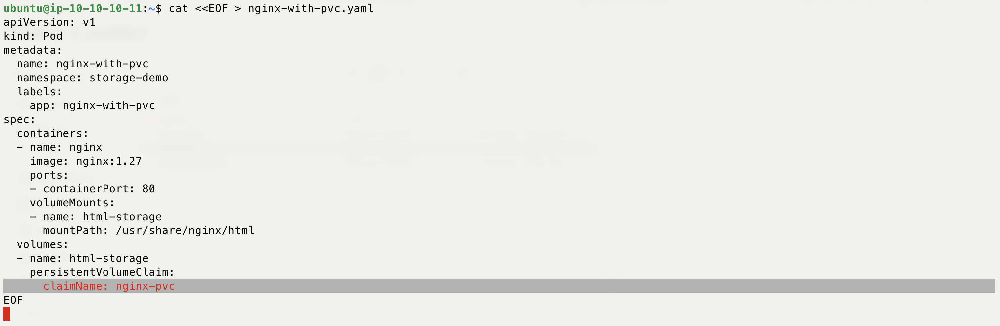

### Step 13 — Deploy the pod

```bash
kubectl apply -f nginx-with-pvc.yaml
kubectl get pods -n storage-demo -o wide
```

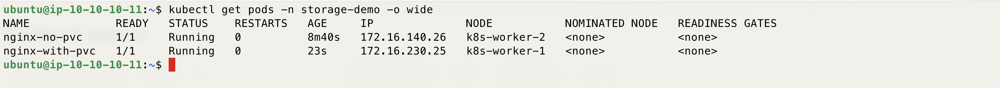

### Step 14 — Confirm the PVC bound, and show the PV it created

```bash
kubectl get pvc -n storage-demo
kubectl get pv
```

The PVC now shows `Bound`, and `local-path-provisioner` created a PV for it the moment the pod was scheduled — this is dynamic provisioning, just deferred until it knew which node to use.

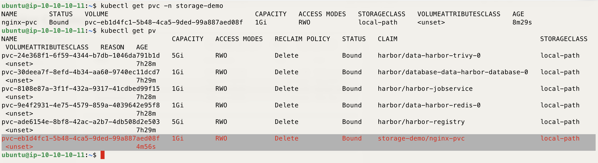

### Step 15 — Write a custom file into the pod

```bash
kubectl exec -it nginx-with-pvc -n storage-demo -- sh -c 'echo "Hello from storage-demo - with PVC" > /usr/share/nginx/html/index.html'
```

### Step 16 — Confirm the file is there

```bash
kubectl exec -it nginx-with-pvc -n storage-demo -- cat /usr/share/nginx/html/index.html
```

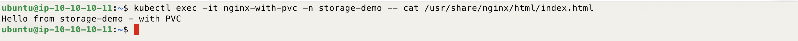

### Step 17 — Delete the pod

```bash
kubectl delete pod nginx-with-pvc -n storage-demo
```

### Step 18 — Confirm the PVC and PV are still there

```bash
kubectl get pvc,pv -n storage-demo
```

The PVC and PV are objects in their own right — deleting the Pod that used them didn't touch either one.

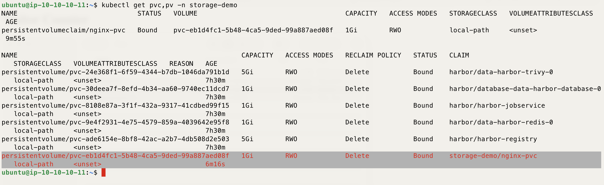

### Step 19 — Recreate the pod from the same manifest

```bash
kubectl apply -f nginx-with-pvc.yaml
kubectl get pods -n storage-demo -o wide
```

### Step 20 — Check the file again

```bash
kubectl exec -it nginx-with-pvc -n storage-demo -- cat /usr/share/nginx/html/index.html
```

This time the custom text is still there. The new Pod mounted the same PVC, and the PVC's data survived the Pod being deleted — the opposite of Part A.

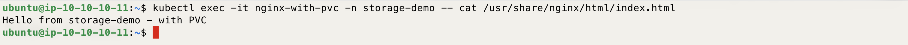

### Step 21 — [Optional] Clean up

```bash
kubectl delete -f nginx-with-pvc.yaml
kubectl delete -f nginx-pvc.yaml
kubectl delete -f nginx-no-pvc.yaml
kubectl delete namespace storage-demo
```

---

Enjoy
