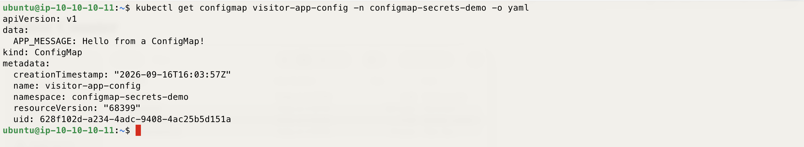
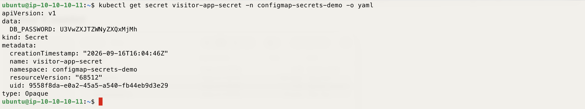
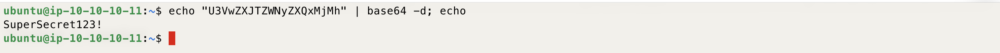
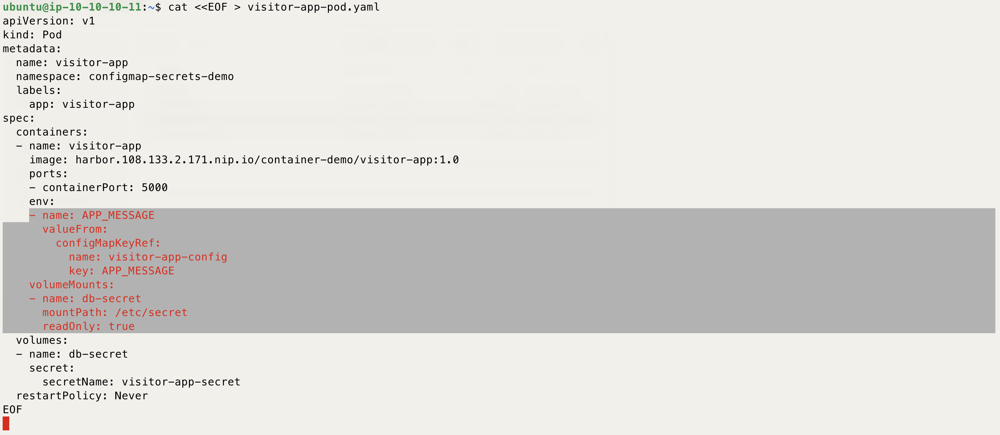
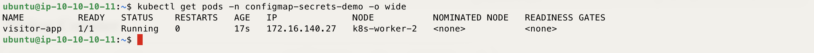
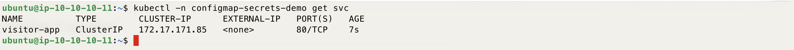
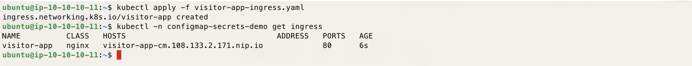
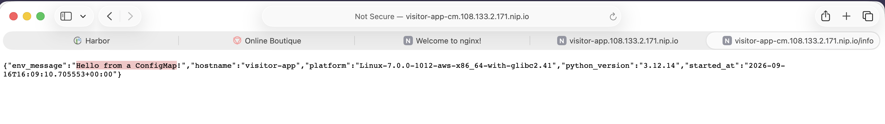
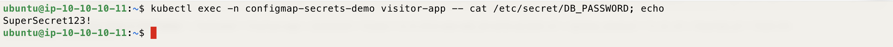

# Demo - ConfigMap & Secrets - K8S On AWS With TerraForm Demo

*Same Visitor Counter app as before — this time its message comes from a ConfigMap, and a Secret is mounted alongside it to show how Kubernetes handles configuration versus sensitive data.*

---

## Description

This demo builds on the previous **Container - Build, Push to Harbor & Deploy** demo. It reuses the same `visitor-app:1.0` image already sitting in Harbor — nothing is rebuilt.

It shows two separate Kubernetes objects, each used the way it's meant to be used:

- **ConfigMap**, injected as an environment variable (`APP_MESSAGE`). The app already reads this variable on its `/info` endpoint — set earlier in the code specifically as a hook for this demo — so you'll see the ConfigMap's value come back live from the running pod.
- **Secret**, mounted as a file inside the pod. The app doesn't read this one — it's mounted purely so you can inspect how a Secret looks both at rest (in the API, base64) and once mounted inside a container (plain text). That contrast is the point of this step.

**This demo depends on the previous demo.** If you haven't completed it yet, go back and run Steps 1 to 7 of the [Container - Build, Push to Harbor & Deploy](/Demo/02-Create-&-Deploy-Container-From-Scratch/README.md) demo first — you need `visitor-app:1.0` already pushed to Harbor before starting here.

---

## Prerequisites

- The previous demo completed through Step 7 — `visitor-app:1.0` present in Harbor under the `container-demo` project.
- `kubectl` on the bastion, already pointed at the cluster.
- Harbor reachable at `https://harbor.<lb-ip>.nip.io`, with its CA already trusted on the bastion and on every node (from the Prep step).

---

| Note: This demo depends on a few steps from the [Container - Build, Push to Harbor & Deploy](/Demo/02-Create-&-Deploy-Container-From-Scratch/README.md) demo. If you haven't done it yet, go back and perform Step 1 to Step 7 there first, to make sure you're able to follow along with this demo.

---

## How to Use

### Step 1 — Create the namespace

```bash
kubectl create namespace configmap-secrets-demo
```

---

### Step 2 — Create the ConfigMap

This holds the message the app will display, under the key `APP_MESSAGE`.

```bash
kubectl create configmap visitor-app-config \
  --namespace configmap-secrets-demo \
  --from-literal=APP_MESSAGE="Hello from a ConfigMap!"
```

---

### Step 3 — View the ConfigMap

```bash
kubectl get configmap visitor-app-config -n configmap-secrets-demo -o yaml
```

Notice the value under `data` is stored as plain, readable text — ConfigMaps are for non-sensitive configuration only.



---

### Step 4 — Create the Secret

This simulates a database password, under the key `DB_PASSWORD`. The app doesn't use this value — it's here so you can inspect how a Secret is stored and mounted.

```bash
kubectl create secret generic visitor-app-secret \
  --namespace configmap-secrets-demo \
  --from-literal=DB_PASSWORD="SuperSecret123!"
```

---

### Step 5 — View the Secret

```bash
kubectl get secret visitor-app-secret -n configmap-secrets-demo -o yaml
```

Notice the value under `data` is base64, not plain text like the ConfigMap — but base64 is encoding, not encryption.



---

### Step 6 — Decode the Secret manually

Copy the base64 string for `DB_PASSWORD` from the previous step's output and decode it:

```bash
echo "<paste-the-base64-value-here>" | base64 -d; echo
```

This should print `SuperSecret123!` back out — proving the Secret object itself gives no real protection on its own; it depends on Kubernetes' RBAC and encryption-at-rest to actually secure it.



---

### Step 7 — Create the pod manifest

Replace `<lb-ip>` with your Load Balancer's public IP (the Terraform output). The ConfigMap is wired in as an environment variable; the Secret is wired in as a mounted volume.

```bash
cat <<EOF > visitor-app-pod.yaml
apiVersion: v1
kind: Pod
metadata:
  name: visitor-app
  namespace: configmap-secrets-demo
  labels:
    app: visitor-app
spec:
  containers:
  - name: visitor-app
    image: harbor.<lb-ip>.nip.io/container-demo/visitor-app:1.0
    ports:
    - containerPort: 5000
    env:
    - name: APP_MESSAGE
      valueFrom:
        configMapKeyRef:
          name: visitor-app-config
          key: APP_MESSAGE
    volumeMounts:
    - name: db-secret
      mountPath: /etc/secret
      readOnly: true
  volumes:
  - name: db-secret
    secret:
      secretName: visitor-app-secret
  restartPolicy: Never
EOF
```



---

### Step 8 — Deploy the pod

```bash
kubectl apply -f visitor-app-pod.yaml
```

---

### Step 9 — Confirm the pod is running

```bash
kubectl get pods -n configmap-secrets-demo -o wide
```

If the pod is stuck in `ImagePullBackOff`, confirm the Harbor CA is trusted on the node it landed on (see the Prep demo, Step 6).



---

### Step 10 — Create a Service for the pod

```bash
cat <<EOF > visitor-app-service.yaml
apiVersion: v1
kind: Service
metadata:
  name: visitor-app
  namespace: configmap-secrets-demo
spec:
  selector:
    app: visitor-app
  ports:
  - port: 80
    targetPort: 5000
EOF
kubectl apply -f visitor-app-service.yaml
kubectl -n configmap-secrets-demo get svc
```



---

### Step 11 — Create an Ingress for the service

Replace `<lb-ip>` with your Load Balancer's public IP.

```bash
cat <<EOF > visitor-app-ingress.yaml
apiVersion: networking.k8s.io/v1
kind: Ingress
metadata:
  name: visitor-app
  namespace: configmap-secrets-demo
spec:
  ingressClassName: nginx
  rules:
  - host: visitor-app-cm.<lb-ip>.nip.io
    http:
      paths:
      - path: /
        pathType: Prefix
        backend:
          service:
            name: visitor-app
            port:
              number: 80
EOF
kubectl apply -f visitor-app-ingress.yaml
kubectl -n configmap-secrets-demo get ingress
```



---

### Step 12 — Confirm the ConfigMap value is live in the app

Open `http://visitor-app-cm.<lb-ip>.nip.io/info` in a browser from your own machine. Check `env_message` in the JSON response — it should show `Hello from a ConfigMap!`, proving the value came from the ConfigMap rather than being baked into the image.



---

### Step 13 — Inspect the mounted Secret inside the pod

```bash
kubectl exec -n configmap-secrets-demo visitor-app -- cat /etc/secret/DB_PASSWORD; echo
```

This prints `SuperSecret123!` in plain text. Compare this to Step 5: the same value was base64 in the API, but once Kubernetes mounts a Secret into a pod, it's presented as a plain file — the encoding only ever applied to how it was stored/transmitted, not to what the running container sees.



---

### Step 14 — [Optional] Clean up

```bash
kubectl delete -f visitor-app-pod.yaml
kubectl delete namespace configmap-secrets-demo
```

---

Enjoy
